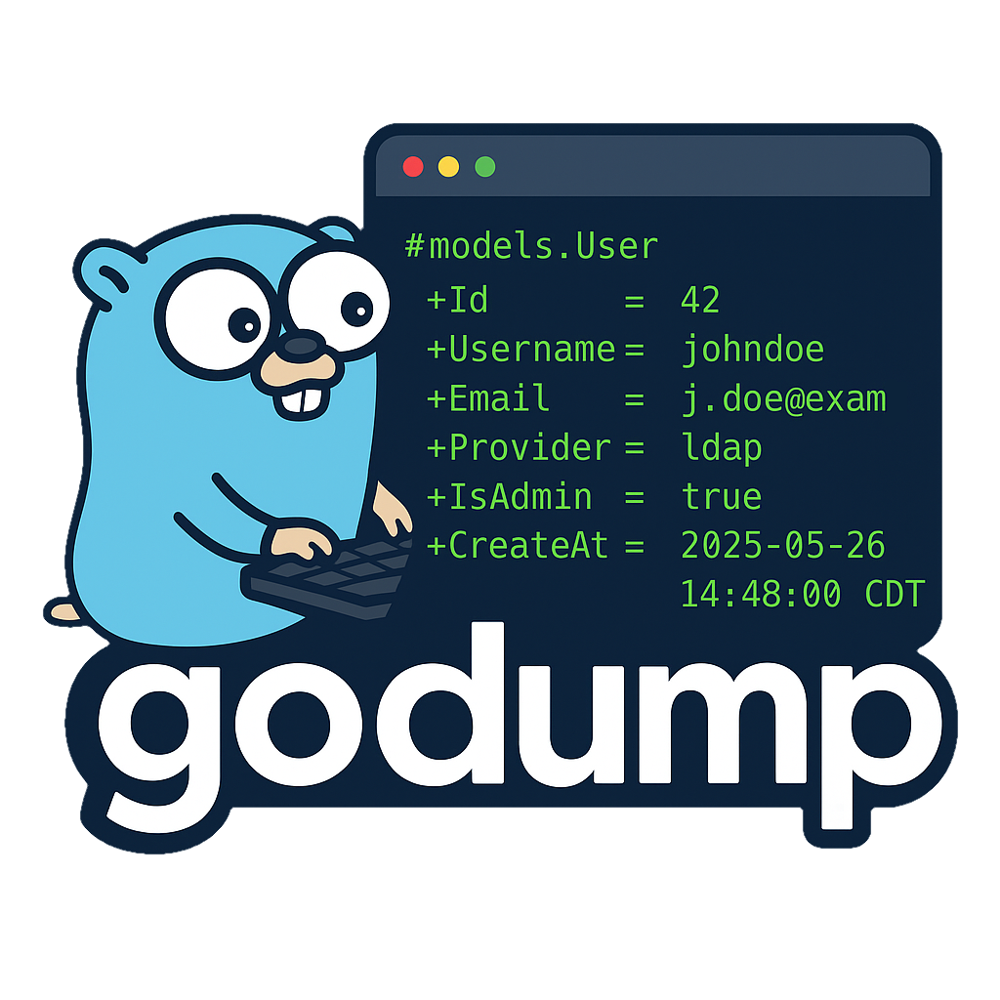
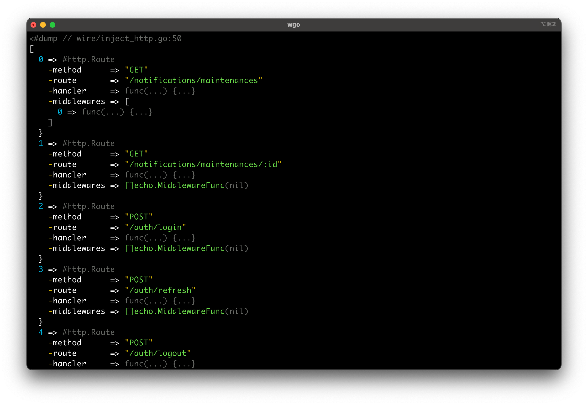
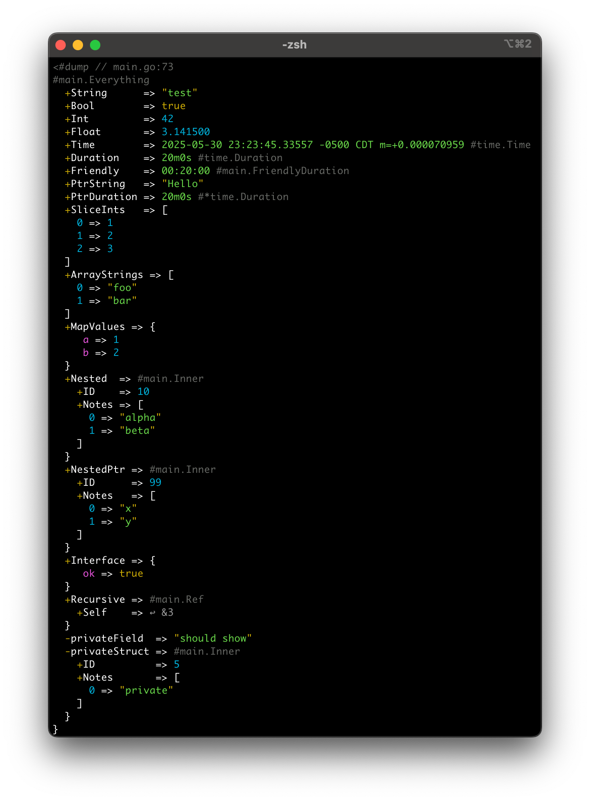
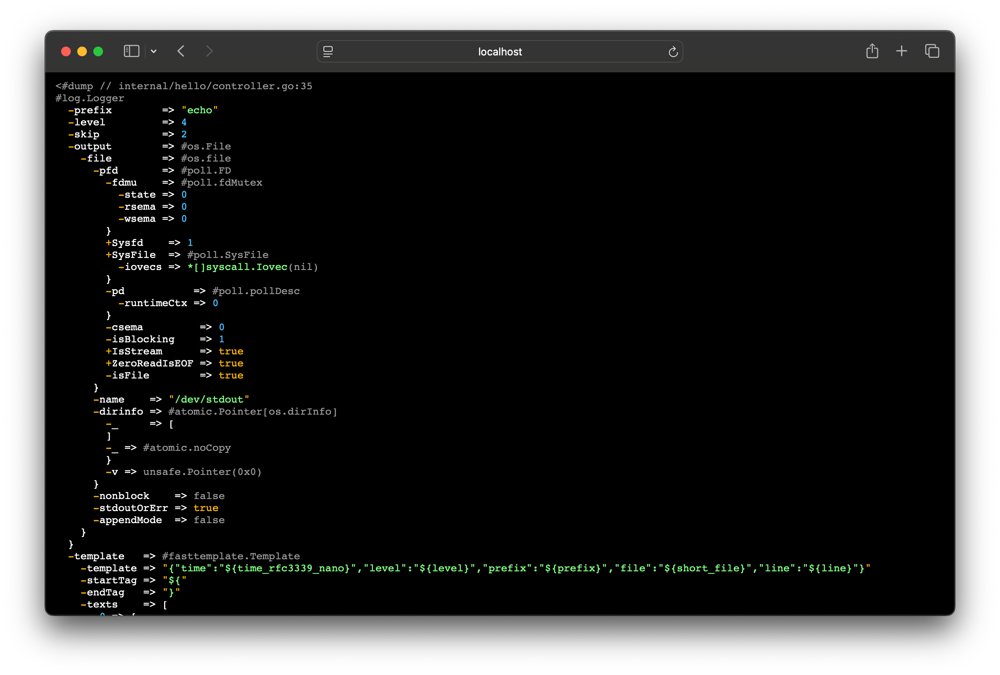

<p align="center">
  
</p>

<p align="center">
    Pretty-print and debug Go structs with a Laravel-inspired developer experience.
</p>

<p align="center">
    <a href="https://pkg.go.dev/github.com/goforj/godump"></a>
    <a href="LICENSE"></a>
    <a href="https://github.com/goforj/godump/actions"></a>
    <a href="https://golang.org"></a>
    
    <a href="https://goreportcard.com/report/github.com/goforj/godump"></a>
    <a href="https://codecov.io/gh/goforj/godump" ></a>
</p>

<p align="center">
  <code>godump</code> is a developer-friendly, zero-dependency debug dumper for Go. It provides pretty, colorized terminal output of your structs, slices, maps, and more — complete with cyclic reference detection and control character escaping.
    Inspired by Symfony's VarDumper which is used in Laravel's tools like <code>dump()</code> and <code>dd()</code>.
</p>

<br>

<p align="center">
<strong>Terminal Output Example (Simple)</strong><br>
  
</p>

<p align="center">
<strong>Terminal Output Example (Kitchen Sink)</strong><br>
  
</p>

<p align="center">
<strong>HTML Output Example</strong><br>
  
</p>

## ✨ Features

- 🧠 Struct field inspection with visibility markers (`+`, `-`)
- 🔄 Cycle-safe reference tracking
- 🎨 ANSI color or HTML output
- 🧪 Handles slices, maps, nested structs, pointers, time, etc.
- 🪄 Control character escaping (`\n`, `\t`, etc.)

## 📦 Installation

```bash
go get github.com/goforj/godump
````

## 🚀 Usage

```go
package main

import (
	"fmt"
	"os"
	"strings"
	"github.com/goforj/godump"
)

type Profile struct {
	Age   int
	Email string
}

type User struct {
	Name    string
	Profile Profile
}

func main() {
	user := User{
		Name: "Alice",
		Profile: Profile{
			Age:   30,
			Email: "alice@example.com",
		},
	}

	// Pretty-print to stdout
	godump.Dump(user)

	// Dump and exit
	godump.Dd(user) // this will print the dump and exit the program

	// Get dump as string
	output := godump.DumpStr(user)
	fmt.Println("str", output)

	// HTML for web UI output
	html := godump.DumpHTML(user)
	fmt.Println("html", html)
	
	// Write to any io.Writer (e.g. file, buffer, logger)
	godump.Fdump(os.Stderr, user)

	// Custom Dumper with all options set explicitly
	d := godump.NewDumper(
		godump.WithMaxDepth(15),          // default: 15
		godump.WithMaxItems(100),         // default: 100
		godump.WithMaxStringLen(100000),  // default: 100000
		godump.WithWriter(os.Stdout),     // default: os.Stdout
	)

	// Use the custom dumper
	d.Dump(user)

	// Dump to string
	out := d.DumpStr(user)
	println("DumpStr output:", out)

	// Dump to HTML string
	html = d.DumpHTML(user)
	println("DumpHTML output:", html)

	// Dump to custom writer (e.g. a string builder)
	var sb strings.Builder
	custom := godump.NewDumper(godump.WithWriter(&sb))
	custom.Dump(user)
	println("Dump to string builder:", sb.String())
}
```

## 🧪 Example Output

```go
<#dump // main.go:26
#main.User
  +Name    => "Alice"
  +Profile => #main.Profile
    +Age   => 30
    +Email => "alice@example.com"
  }
}
```

## 📘 How to Read the Output

`godump` output is designed for clarity and traceability. Here's how to interpret its structure:

### 🧭 Location Header

```go
<#dump // main.go:26
````

* The first line shows the **file and line number** where `godump.Dump()` was invoked.
* Helpful for finding where the dump happened during debugging.

### 🔎 Type Names

```go
#main.User
```

* Fully qualified struct name with its package path.

### 🔐 Visibility Markers

```go
  +Name    => "Alice"
  -secret  => "..."
```

* `+` → Exported (public) field
* `-` → Unexported (private) field (accessed reflectively)

### 🔄 Cyclic References

If a pointer has already been printed:

```go
↩︎ &1
```

* Prevents infinite loops in circular structures
* References point back to earlier object instances

### 🔢 Slices and Maps

```go
  0 => "value"
  a => 1
```

* Array/slice indices and map keys are shown with `=>` formatting and indentation
* Slices and maps are truncated if `maxItems` is exceeded

### 🔣 Escaped Characters

```go
"Line1\nLine2\tDone"
```

* Control characters like `\n`, `\t`, `\r`, etc. are safely escaped
* Strings are truncated after `maxStringLen` runes

### 🧩 Supported Types

* ✅ Structs (exported & unexported)
* ✅ Pointers, interfaces
* ✅ Maps, slices, arrays
* ✅ Channels, functions
* ✅ time.Time (nicely formatted)

## 🧩 License

MIT © [goforj](https://github.com/goforj)

## 📇 Author

Created by [Chris Miles](https://github.com/akkadius)  
Maintained as part of the [goforj](https://github.com/goforj) tooling ecosystem.
